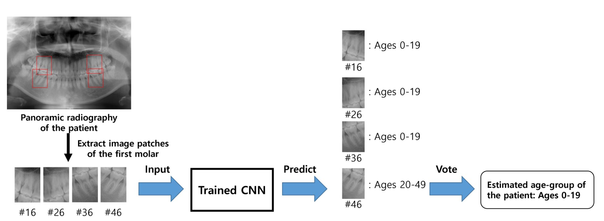
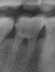
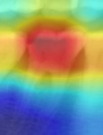

# pytorch-dental_age_estimation

[](https://github.com/nonstop1962/pytorch-dental_age_estimation/blob/master/LICENSE)

This is the official PyTorch implementation of our paper: [Age-group determination of living individuals using first molar images based on artificial intelligence](https://www.nature.com/articles/s41598-020-80182-8). 

## Introduction
---
Dental age estimation of living individuals is difficult and challenging, and there is no consensus method in adults with permanent dentition. Thus, we aim to provide an accurate and robust artificial intelligence (AI)-based diagnostic system for age-group estimation by incorporating a convolutional neural network (CNN) using dental x-ray images of the first molars. The data set consisted of four first molar images from the right and left sides of the maxilla and mandible of each of 1,586 individuals across all age groups, which were extracted from their panoramic radiographs. The accuracy of tooth-wise estimation was 89.05% to 90.27 %. The performance accuracy was evaluated mainly using a majority voting system and area under curve (AUC) scores. The AUC scores ranged from 0.94 to 0.98 for all age-groups, which indicates outstanding capacity. The learned features of CNNs were visualized as a heatmap, and revealed that CNNs focus on differentiated anatomical parameters, including tooth pulp, alveolar bone level, or interdental space depending on age and location of tooth. With this, we provided a deeper understanding of the most informative regions distinguished by age groups. The prediction accuracy and heat map analyses support that this AI-based age-group determination model is plausible and useful. 

<p align="center">
  
</p>


## Installation
---
* Clone this repository 
```
 git clone https://github.com/nonstop1962/pytorch-dental_age_estimation.git
 cd pytorch-dental_age_estimation
```
* Install dependencies using pip:
```
pip install -r requirements.txt
```

## Data preperation
---
The dental dataset we used in the paper is confidential and cannot be disclosed publicly. Anyone who want to access the dataset, please send us an email.

Email of the author (Seunghyeon Kim): ksh@robotics.snu.ac.kr

Dataset folder should be constructed as follows:
```bash
Dental_dataset
    Train Folder-----
        JPEGImages----
            0001.png
            0002.png
            .......
        ClassificationClass---
            3classes---
                0001.txt
                0002.txt
                .......
            5classes---
                0001.txt
                0002.txt
                .......
        ImageSets---
            Classification---
                train.txt
                val.txt
                eval.txt 
                .......
```
* `JPEGImages`: Folder for containing image files
* `ClassificationClass`: Folder for containing label files (.txt format)
* `ImageSets`: Folder for containing train/val/eval split information (.txt format)


## Code usage 
---
### Setup config file (.yml file)
* sample config file for `training`: config/resnet152_classification.yml
* sample config file for `evaluation`: config/resnet152_classification-evaluation.yml
```
module:
    # Model configuration
    mode: classification
    network:
        name: resnet152
        n_classes: 3
        pretrained: True

    # Path of model file used for evaluation (not used for training)
    load_state:
        file: {PATH_TO_TRAINED_MODEL_PATH}
        optimizer: False

    # Training parameter setting
    loss:
        name: 'cross_entropy_cls'
    metric:
        name: "runningScore_cls"
    optimizer:
        name:  'adam'
        lr: 5.0e-5
    scheduler:

    # Dataset setting
    data:
        dataset_type: directory
        code: /HDD0/shkim/research/thesis/Database_thesis/Medical/Dental_directory_dataset # directory of dataset root
        label: 3classes # label folder name
        mode: Classification
        img_size: [112, 151] # input width, height
        n_classes: 3
        training:
            split: train1 # Training image set txt file name
            augmentation: # augmentation setting
                rotate90_onlyimg: True
                vflip_onlyimg: 0.5
                hflip_onlyimg: 0.5
            shuffle: True
            batch_size: 32
            n_workers: 8
        validation:
            split: val1 # Validation image set txt file name
            batch_size: 1
            n_workers: 4
setting:
    seed: 1337
    train_iters: 30000
    print_interval: 100
    val_interval: 1000
    save_interval: 1000
    print_time: False
```

### Main file usage
``` 
python main.py [--log_root_dir [LOG_ROOT_DIR]] [--config [CONFIG]] [--task [TASK]] [--multi_gpu]

  --log_root_dir        directory for saving training results (model file)  
  --config              Configuration file path to use (.yml file path)                 
  --task                Choose task to run 'train' or 'eval'
  --multi_gpu           Use multi-gpu for the task
```

### To train the model
Sample command line execution:
```
python main.py --log_root_dir /home/user/trained_results --config config/resnet152_classification.yml --task train
```
Note: Model files will be saved on `--log_root_dir`

### To evaluate the model
Sample command line execution:
```
python main.py --config config/resnet152_classification-evaluation.yml --task eval
```
Note: The path of the model file to be used fro evaluation must be specified on `load_state` field of the config file.

Note: Output of the evaluation will be save under the save directory as the path of the model file used for evaluation. 
* Output of the evaluation
    1. `Predicted class` of each image file as text file (e.g. 0, 1, 2 ...)
    2. `Predicted logits value` of each image file as text file. (e.g. [0.1, 0.2, 0.7], [0.3, 0.4, 0.3], ...)

## Reproduce the results in paper
---
### 1. Reproduce Table 1 (classification accuracies)
Prepare: 
* `Predicted class` evaluation results of five fold class validation experiments.

Run:
* jupyter_notebooks/\[Dental\]3class_evaluation.ipynb
* jupyter_notebooks/\[Dental\]5class_evaluation.ipynb
* jupyter_notebooks/\[Dental\]3class+5class voting evaluation.ipynb

### 2. Reproduce Figure 3 (plot confusion matrix)
Prepare:
* The result files from `1. Reproduce Table 1 (classification accuracies)`
    1. 3cls_conf_mat_tot.npy
    2. 5cls_conf_mat_tot.npy
    3. 5cls_conf_mat_tot(regroup).npy

Run: 
* jupyter_notebooks/\[Dental\]Confusion matrix figure.ipynb

### 3. Reproduce Figure 6 (ROC curves)
Prepare: 
* `Predicted logits value` evaluation results of five fold class validation experiments.

Run:
* jupyter_notebooks/\[Dental\]multiclass AUROC calculate and plot (3cls vs 5cls).ipynb

### 4. Reproduce Figure 4 (gradCAM)
Run: main_gradCAM.py

Usage
```
python main_gradCAM.py [--log_root_dir [LOG_ROOT_DIR]] [--config [CONFIG]] [--image-path IMAGE_PATH] [--label-path LABEL_PATH]

  --log_root_dir        directory for saving gradCAM results
  --config              Configuration file path to use (same config file as training phase)
  --image-path          Input image path (e.g. 001.png)
  --label-path          Input label path (e.g. 001.txt)
```

Sample command line:
```
python main_gradCAM.py --log_root_dir /home/user/gradCAM_results --config config/resnet152_classification.yml --image-path /home/user/001.png --label-path /home/user/001.txt
```

Sample gradCAM result when running the above command line code (left: original image, right: gradCAM result): 
<p align="center">
  
  
</p>


